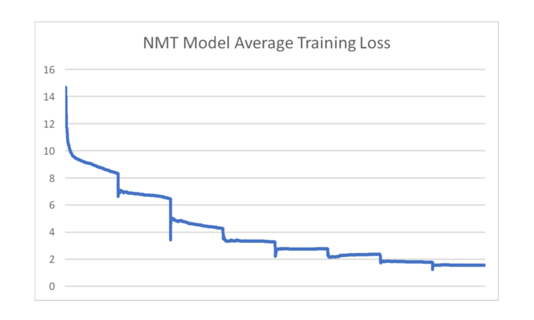
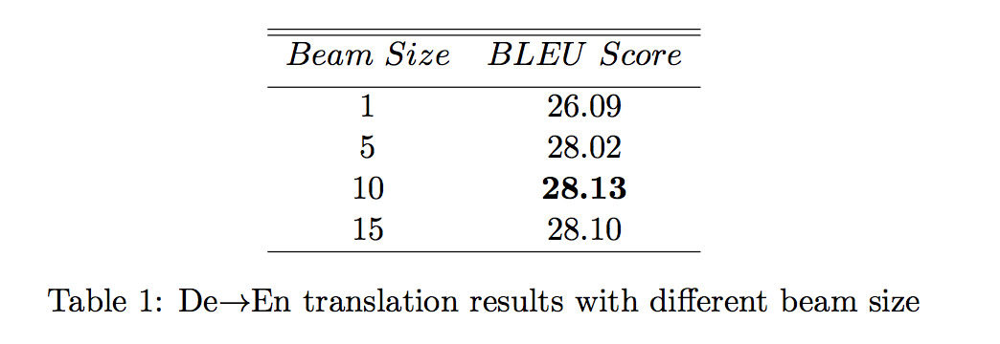

# Attentional-NMT

Attention-Based Neural Machine Translation

## Intro
In this project, we want to apply attentional mechanism to the deep neural network and translate German to English. The data we use is from IWLST14 dataset. For the result, we will evaluate it by BLEU scores.

## Dataset
Following previous works (Ranzato et al., 2015; Bahdanau et al., 2016), the dataset we use is from IWLST 2014 evaluation campaign (Cettolo et al., 2014), consisting of training/dev/test corpus with ap- proximately 153k, 7k, 6.5k bilingual sentence pairs respectively. The maximal sentence length is set as 50. The dictionary for English and German corpus respectively include 21,415 and 30,457 most frequent words, with other words replaced as a special token ‘UNK’.


## Method
#### 1. Training
We built the NMT model according to the methods we described before, a RNN based encoding-decoding framework with attention mechanism. For layers LSTMs act as encoder and decoder. The dimension of word embedding and LSTM hidden state are both set as 1000 is set as 1,000. To compare the performance with greedy search and beam search, the beam window is set as 5.

#### 2. Inference
We firstly tried greedy algorithm, then came to Beam Search Algorithm. The basic idea of this algorithm is to set a window size of N and keep track of those top N most possible word combinations. we tried the window size from 1 to 15 and found that the performance increased as the window size incresed.


## Result
Our model training loss is shown in the following picture: 


To learn the effect of different beam sizes when doing inference (translation), we set the beam size from 1 to 15. The De→En translation performance are shown below. 


## How to run the code
#### 1. train the model:
```
python train.py --data data-bin/iwslt14.tokenized.de-en/ --optimizer Adam --learning_rate 1e-3 --model_file checkpoints/iwlst14/ --gpuid 0
```

#### 2. generate translation:
```
python generate.py --data data-bin/iwslt14.tokenized.de-en/ --batch-size 128 --model_file checkpoints/iwlst14/best_gmodel.pt --gpuid 0 --remove-bpe --beam 5
```

#### 3. compute BLEU scores:
```
perl scripts/multi-bleu.perl < ground_truth.txt translation.txt
```

## Reference
[1] Luong, Minh-Thang, Hieu Pham, and Christopher D. Manning. Effective approaches to attention- based neural machine translation. arXiv preprint arXiv:1508.04025 (2015).

[2] Bahdanau, Dzmitry, Kyunghyun Cho, and Yoshua Bengio. Neural machine translation by jointly learning to align and translate. arXiv preprint arXiv:1409.0473 (2014).

[3] Vaswani, Ashish, et al. Attention is all you need. Advances in Neural Information Processing Systems. 2017.

[4] Gehring, Jonas, et al. Convolutional sequence to sequence learning. arXiv preprint arXiv:1705.03122 (2017).
